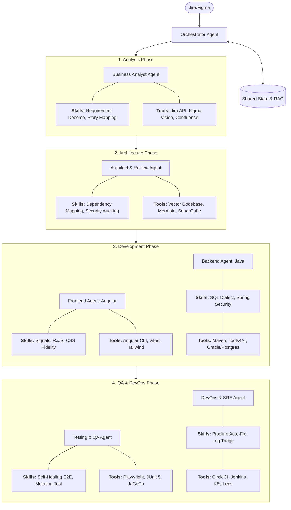

- 前端开发AI Agent智能体 https://mp.weixin.qq.com/s/wylewnVxyJzeGkQqdCiLqg
- 不写代码、不花钱, 如何利用智能体与MCP 实现UI前端开发 https://mp.weixin.qq.com/s/EplHjVbG9kSTDVgc858MLw
- 智能体（AI Agent）开发完整指南 https://mp.weixin.qq.com/s/40uJUP9oO8ARNuZYT0jKCg
- 前端开发AI Agent智能体，需要掌握哪些知识？https://mp.weixin.qq.com/s/uBS0OHZPd6_Pp48dMYGXVQ
- 从需求到研发全自动：如何基于Multi-Agent架构打造AI前端工程师 https://mp.weixin.qq.com/s/Huf3rfXM0hDqRe87VXiftg
- AI代理的上下文工程：构建Manus的经验教训 https://manus.im/zh-cn/blog/Context-Engineering-for-AI-Agents-Lessons-from-Building-Manus
- Google放大招：让前端工程师也能开发AI智能体了 https://mp.weixin.qq.com/s/IkDF57EWQxbjKIx4w-nR1g
- Solace: Getting started with Agentic ai https://solace.com/blog/getting-started-with-agentic-ai
- https://www.reddit.com/r/ClaudeAI/comments/1ltsxg0/thanks_to_multi_agents_a_turning_point_in_the/
- The Evolution and History of AI Agents https://www.ema.co/additional-blogs/addition-blogs/history-evolution-ai-agents
- https://inspira.ai/agents/history-of-agents-and-agentic-workflows
- https://medium.com/google-cloud/what-is-an-agent-and-does-your-data-need-one-928db7cbde81
- https://www.mindset.ai/blogs/what-is-the-future-of-agentic-ai
- https://www.mindset.ai/blogs/how-have-ai-agents-evolved-over-time
- https://medium.com/google-cloud/what-is-an-agent-and-does-your-data-need-one-928db7cbde81
- Trae官方的 8 个AI 智能体 https://mp.weixin.qq.com/s/Z0fi-ngXUKMcxcwWwUPrhg
- AI Agent（智能体）技术白皮书 https://www.kaggle.com/whitepaper-agents
- AI Agent（智能体）技术白皮书 https://arthurchiao.art/blog/ai-agent-white-paper-zh/

## Agentic AI Development Architecture

### AI Agent Capabilities Matrix (SDLC 2026)

| Development Phase | Agent | Category | Name | Description |
| :--- | :--- | :--- | :--- | :--- |
| **1. Analysis & Design** | Business Analyst | **Tool** | **Jira API** | Fetches/updates user stories and manages ticket status. |
| | Business Analyst | **Tool** | **Figma Vision** | Analyzes UI designs via vision-models to extract layout requirements. |
| | Business Analyst | **Skill** | **Requirement Decomp** | Breaks high-level designs into actionable, modular sub-tasks. |
| | Business Analyst | **Skill** | **Story Mapping** | Aligns new features with existing user journeys in Confluence. |
| **2. Architecture Phase** | Architect & Review | **Tool** | **Vector Codebase** | RAG-based search to understand existing code structure. |
| | Architect & Review | **Tool** | **SonarQube** | Automates code quality and security vulnerability auditing. |
| | Architect & Review | **Skill** | **Dependency Mapping** | Analyzes cross-service impact between Java APIs and Angular UI. |
| | Architect & Review | **Skill** | **Security Auditing** | Ensures code adheres to OWASP standards and internal policies. |
| **3. Development (FE)** | Frontend (Angular) | **Tool** | **Angular CLI** | Generates components, runs builds, and manages dependencies. |
| | Frontend (Angular) | **Tool** | **Vitest** | Performs fast, unit-level validation of Angular signals/logic. |
| | Frontend (Angular) | **Skill** | **RxJS / Signals** | Manages reactive state and data streams for high-performance UI. |
| | Frontend (Angular) | **Skill** | **CSS Fidelity** | Ensures the generated CSS matches Figma design specs exactly. |
| **3. Development (BE)** | Backend (Java) | **Tool** | **Tools4AI** | Java framework that exposes Spring services as agent tools. |
| | Backend (Java) | **Tool** | **Oracle/Postgres** | Interacts with DBs to verify schema changes or query performance. |
| | Backend (Java) | **Skill** | **SQL Dialect Switching** | Translates logic between Oracle PL/SQL and standard PostgreSQL. |
| | Backend (Java) | **Skill** | **Spring Security** | Implements robust JWT/OAuth authentication patterns in Java. |
| **4. Validation & Ops** | Testing & QA | **Tool** | **Playwright** | Executes E2E tests in browsers to verify full-stack flows. |
| | Testing & QA | **Tool** | **JUnit 5** | Validates Java microservice logic through automated unit tests. |
| | Testing & QA | **Skill** | **Self-Healing E2E** | Updates test selectors automatically when the UI structure changes. |
| | Testing & QA | **Skill** | **Mutation Testing** | Validates test suite quality by injecting faults into the code. |
| **4. Validation & Ops** | DevOps & SRE | **Tool** | **CircleCI / Jenkins** | Manages build pipelines and deployment triggers. |
| | DevOps & SRE | **Tool** | **K8s Lens** | Monitors cluster health and pod status for microservices. |
| | DevOps & SRE | **Skill** | **Pipeline Auto-Fix** | Analyzes logs to resolve build failures (e.g., dependency conflicts). |
| | DevOps & SRE | **Skill** | **Log Triage** | Identifies root causes from distributed logs during failures. |

